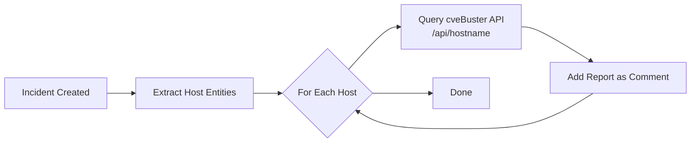

# cveBuster-get-vulnerability-details

Author: cveBuster

This playbook enriches Microsoft Sentinel incidents with detailed vulnerability reports from the cveBuster API. When a Sentinel incident is created, the playbook:

1. **Extracts Host entities** from the incident
2. **Queries the cveBuster API** for each host using the `/api/{hostname}` endpoint
3. **Adds formatted vulnerability reports** as incident comments

This provides security analysts with immediate visibility into vulnerabilities affecting compromised or suspicious hosts, enabling faster triage and remediation decisions.

## Prerequisites

1. **cveBuster API Server** must be deployed and accessible
   - Default endpoint: `http://cvebuster.eastus.cloudapp.azure.com:5000`
   - Must support the `/api/{hostname}` endpoint (e.g., `/api/bobvm`)
   - API should return formatted text reports (like the `/api/bobvm` endpoint in `app_paginated.py`)

2. **Microsoft Sentinel Workspace** configured with incidents

3. **Network Access** - Logic App must be able to reach your cveBuster API endpoint

## Quick Deployment

### Deploy with Incident Trigger (Recommended)

Deploy this playbook and attach it to an **automation rule** to ensure it runs automatically whenever an incident is created.

[](https://portal.azure.com/#create/Microsoft.Template/uri/https%3A%2F%2Fraw.githubusercontent.com%2FAzure%2FAzure-Sentinel%2Fmaster%2FSolutions%2FcveBuster%2520Vulnerability%2520Scanning%2FPlaybooks%2FcveBuster-get-vulnerability-details%2Fincident-trigger%2Fazuredeploy.json)

[Learn more about automation rules](https://docs.microsoft.com/azure/sentinel/automate-incident-handling-with-automation-rules#creating-and-managing-automation-rules)

## Post Deployment Instructions

### 1. Authorize Connections

After deployment, authorize the Microsoft Sentinel connection:

1. Go to **Resource Group** → Select your resource group
2. Find the connection named `azuresentinel-cveBuster-get-vulnerability-details`
3. Click **Edit API connection**
4. Click **Authorize** and sign in with an account that has Microsoft Sentinel Responder permissions
5. Click **Save**

### 2. Assign Permissions

Grant the playbook's managed identity permissions to Microsoft Sentinel:

```powershell
# Get the playbook's principal ID
$playbookName = "cveBuster-get-vulnerability-details"
$resourceGroup = "your-resource-group-name"
$workspaceName = "your-sentinel-workspace-name"

$playbook = Get-AzLogicApp -ResourceGroupName $resourceGroup -Name $playbookName
$principalId = $playbook.Identity.PrincipalId

# Assign Microsoft Sentinel Responder role
$workspaceId = (Get-AzOperationalInsightsWorkspace -ResourceGroupName $resourceGroup -Name $workspaceName).ResourceId
New-AzRoleAssignment -ObjectId $principalId -RoleDefinitionName "Microsoft Sentinel Responder" -Scope $workspaceId
```

### 3. Configure API Endpoint (if needed)

If your cveBuster API is hosted at a different URL:

1. Open the Logic App in the Azure Portal
2. Click **Logic app designer**
3. Expand **Parameters** section
4. Update the `cveBusterApiEndpoint` parameter value
5. Click **Save**

### 4. Create Automation Rule

Attach the playbook to an automation rule so it runs automatically:

1. In Microsoft Sentinel, go to **Automation** → **Automation rules**
2. Click **+ Create** → **Automation rule**
3. Configure:
   - **Name**: "Enrich incidents with cveBuster vulnerability data"
   - **Trigger**: When incident is created
   - **Conditions**: (Optional) Filter for incidents with Host entities
   - **Actions**: Run playbook → Select `cveBuster-get-vulnerability-details`
4. Click **Apply**

## How It Works



## Example Output

When the playbook runs, it adds a comment to the incident with vulnerability details:

```
╔══════════════════════════════════════════════════════════════════════╗
║              BOBVM VULNERABILITY ASSESSMENT REPORT                   ║
╚══════════════════════════════════════════════════════════════════════╝

📊 Total Vulnerabilities: 5
🎯 Asset Criticality: High
📅 Last Assessed: 2026-01-18 20:15 UTC

━━━━━━━━━━━━━━━━━━━━━━━━━━━━━━━━━━━━━━━━━━━━━━━━━━━━━━━━━━━━━━━━━━━━━━

🔴 [1] CVE-2024-49112 - CVSS 9.8
    Windows Lightweight Directory Access Protocol (LDAP) Remote Code Execution
    
    Severity: Critical | ✅ Patch Available
    
    🔧 REMEDIATION:
    • Apply Windows security updates immediately
    • Disable SMBv1 protocol if enabled
    ...
```

## Troubleshooting

### Connection Authorization Failed
- Ensure you have **Microsoft Sentinel Contributor** permissions
- Re-authorize the connection in the Azure Portal

### HTTP 404 - API Endpoint Not Found
- Verify your cveBuster API is running: `curl http://your-api:5000/api/bobvm`
- Check the `cveBusterApiEndpoint` parameter in the Logic App
- Ensure hostname matches your API's expected format (lowercase)

### No Comments Added to Incident
- Check Logic App run history for errors
- Verify the incident has Host entities
- Confirm the Managed Identity has Microsoft Sentinel Responder role

## Screenshots

**Logic App Designer View:**


**Incident with Vulnerability Report:**

