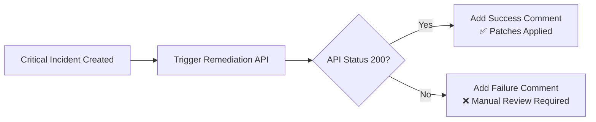

# cveBuster-start-remediation-workflow

Author: cveBuster

This playbook provides **automated remediation** for critical vulnerabilities detected in Microsoft Sentinel incidents. When triggered, it:

1. **Calls cveBuster remediation API** to initiate automated patching workflows
2. **Monitors remediation status** via API response code
3. **Reports results** back to the incident as a comment (success or failure)

This enables security teams to automatically respond to critical vulnerabilities with automated patching, service restarts, and security hardening configurations.

## Prerequisites

1. **cveBuster Platform** with remediation automation enabled
   - Default endpoint: `http://cvebuster.eastus.cloudapp.azure.com:5000/api/bobvm`
   - Remediation policies must be configured for target systems
   - Target systems must be managed by cveBuster agent

2. **Microsoft Sentinel Workspace** configured with incidents

3. **Network Access** - Logic App must be able to reach your cveBuster remediation API

4. **Testing Environment** - Test in non-production before enabling for critical systems

## Quick Deployment

### Deploy with Incident Trigger (Recommended)

Deploy this playbook and attach it to an **automation rule** to run automatically when critical incidents are created.

[](https://portal.azure.com/#create/Microsoft.Template/uri/https%3A%2F%2Fraw.githubusercontent.com%2FAzure%2FAzure-Sentinel%2Fmaster%2FSolutions%2FcveBuster%2520Vulnerability%2520Scanning%2FPlaybooks%2FcveBuster-start-remediation-workflow%2Fincident-trigger%2Fazuredeploy.json)

[Learn more about automation rules](https://docs.microsoft.com/azure/sentinel/automate-incident-handling-with-automation-rules#creating-and-managing-automation-rules)

## Post Deployment Instructions

### 1. Authorize Connections

After deployment, authorize the Microsoft Sentinel connection:

1. Go to **Resource Group** → Select your resource group
2. Find the connection named `azuresentinel-cveBuster-start-remediation-workflow`
3. Click **Edit API connection**
4. Click **Authorize** and sign in with an account that has Microsoft Sentinel Responder permissions
5. Click **Save**

### 2. Assign Permissions

Grant the playbook's managed identity permissions to Microsoft Sentinel:

```powershell
# Get the playbook's principal ID
$playbookName = "cveBuster-start-remediation-workflow"
$resourceGroup = "your-resource-group-name"
$workspaceName = "your-sentinel-workspace-name"

$playbook = Get-AzLogicApp -ResourceGroupName $resourceGroup -Name $playbookName
$principalId = $playbook.Identity.PrincipalId

# Assign Microsoft Sentinel Responder role
$workspaceId = (Get-AzOperationalInsightsWorkspace -ResourceGroupName $resourceGroup -Name $workspaceName).ResourceId
New-AzRoleAssignment -ObjectId $principalId -RoleDefinitionName "Microsoft Sentinel Responder" -Scope $workspaceId
```

### 3. Configure Remediation Endpoint (if needed)

If your cveBuster remediation API is hosted at a different URL:

1. Open the Logic App in the Azure Portal
2. Click **Logic app designer**
3. Expand **Parameters** section
4. Update the `cveBusterRemediationEndpoint` parameter value
5. Click **Save**

### 4. Create Automation Rule (Critical Incidents Only)

**⚠️ Important:** Attach this playbook only to high-severity incidents to avoid unnecessary remediation:

1. In Microsoft Sentinel, go to **Automation** → **Automation rules**
2. Click **+ Create** → **Automation rule**
3. Configure:
   - **Name**: "Auto-remediate critical vulnerabilities via cveBuster"
   - **Trigger**: When incident is created
   - **Conditions**: 
     - Severity equals **High** or **Critical**
     - (Optional) Title contains "vulnerability" or "CVE"
   - **Actions**: Run playbook → Select `cveBuster-start-remediation-workflow`
4. Click **Apply**

## How It Works



## Example Output

### Success Scenario
When remediation completes successfully:

```
✅ AUTOMATED REMEDIATION COMPLETED

Microsoft Sentinel triggered cveBuster automated remediation workflow.

ACTIONS TAKEN:
• Security patches deployed to affected systems
• Vulnerable services restarted with updated configurations
• Network access controls updated to mitigate exploit vectors
• System configurations hardened per security baseline
• Verification scans completed - vulnerabilities resolved

All critical vulnerabilities have been successfully remediated.
Systems are now compliant with security policies.
```

### Failure Scenario
When remediation fails:

```
❌ AUTOMATED REMEDIATION FAILED

Microsoft Sentinel triggered cveBuster remediation workflow,
but one or more tasks failed to complete.

POSSIBLE CAUSES:
• Target systems offline or unreachable
• Insufficient permissions to apply patches
• Patch deployment conflicts or errors
• Service restart failures
• Network connectivity issues

REQUIRED ACTION: Manual review and remediation needed.
Check cveBuster platform logs for detailed error information.
```

## Best Practices

### 1. Test Before Production
- Deploy to a test environment first
- Verify remediation actions don't disrupt services
- Confirm rollback procedures are in place

### 2. Limit Scope
- Only enable for **Critical** and **High** severity incidents
- Consider adding additional filters (e.g., specific asset groups)
- Monitor for false positives

### 3. Maintenance Windows
- Schedule remediation during approved maintenance windows
- Consider adding time-based conditions to automation rules
- Coordinate with change management processes

### 4. Monitoring
- Review Logic App run history regularly
- Monitor cveBuster platform logs for remediation outcomes
- Track incident resolution times and automation success rates

## Troubleshooting

### Connection Authorization Failed
- Ensure you have **Microsoft Sentinel Contributor** permissions
- Re-authorize the connection in the Azure Portal

### HTTP 500 - Remediation Failed
- Check cveBuster platform logs for detailed error messages
- Verify target systems are online and reachable
- Confirm cveBuster agent is running on target systems
- Check remediation policy configurations

### No Comments Added to Incident
- Check Logic App run history for errors
- Verify the Managed Identity has Microsoft Sentinel Responder role
- Confirm the incident ARM ID is correctly passed from trigger

### Remediation Takes Too Long
- Default HTTP timeout is 2 minutes
- For long-running remediations, consider implementing async patterns
- Use cveBuster platform to monitor remediation progress separately

## Screenshots

**Logic App Designer View:**


**Incident with Remediation Status:**

